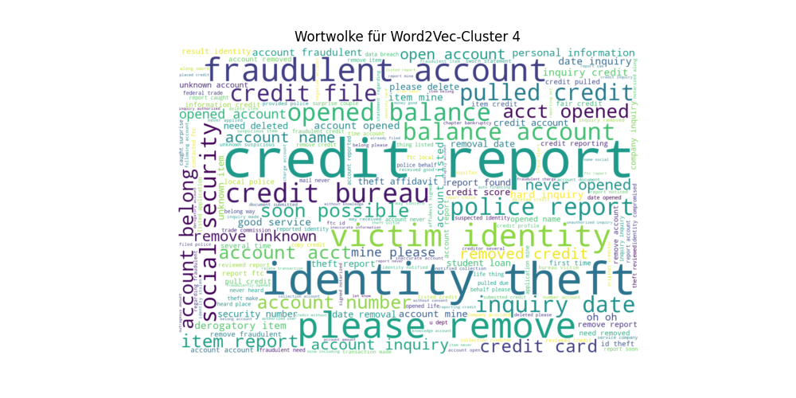

# NLP-Clouds

Dieses GitHub-Repository dient der Verwaltung des Quellcodes eines Studienprojekts, das sich mit der thematischen Modellierung und Clusteranalyse von Textdaten befasst. Der Schwerpunkt des Projekts liegt auf der automatisierten Verarbeitung von Kundenbeschwerden, um Muster und Themen innerhalb der Beschwerdetexte zu identifizieren und zu kategorisieren. Ziel ist es, durch den Einsatz moderner Methoden der Datenanalyse und des maschinellen Lernens eine effiziente und skalierbare Lösung zur Strukturierung und inhaltlichen Auswertung großer Textdatensätze zu entwickeln. Zum Einsatz kommen LDA und Word2Vec zum Verarbeiten der Daten, welche mittels Wörterwolken Themengebiete dem Anwender anzeigt.

## Ergebnisse und Visualisierung
Im Ordner output/wordcoulds gibt ed für LDA fünf Abbildungen/Wortwolken und für Word2Vec fünf Abbildungen/Wortwolken: 

https://github.com/andreas-steinmann/NLP-Clouds/tree/main/output/wordclouds

## Vergleich der Ergebnisse:
Latent Dirichlet Allocation (LDA) neigt dazu, sich auf übergeordnete Themen zu fokussieren und bieten eine breite Kategorisierung von Themen, während Word2Vec-Cluster spezifischer auf die Details der Beschwerden eingehen. In beiden Modellen tauchen ähnliche Schlüsselwörter auf, z.B. «credit report» und «identity theft» aber Word2Vec scheint sich mehr auf die Beziehungen zwischen den Wörtern in einem kontextuellen Sinne zu konzentrieren, während LDA eher auf allgemeine thematische Gruppierungen abzielt.


| LDA Wortwolke Credit Report | Word2Vec Wortwolke Credit Report |
| ------- | ------- |
|  |  |

## Abschließende Diskussion:
Die gemeinsame Verwendung von beiden Ansätzen sorgt für eine Ergänzung. Word2Vec bietet eine detailliertere, kontextbezogenere Analyse der Datensätze, während LDA eher versucht größere, übergeordnete thematische Zusammenhänge aufzuzeigen. Die Modelle können nicht 1 zu 1 miteinander verglichen werden, da sie einen unterschiedlichen Hintergrund besitzen und ein unterschiedliches Ziel verfolgen. Dieses Beispiel zeigt auf, wie wichtig es ist bei einem Projekt nicht nur eine Richtung zu verfolgen, sondern mehrerer Lösungswege zu prüfen. Je nach Anforderung ist somit LDA oder halt Word2Vec besser geeignet.

## **Projektstruktur**

```
NLP-Clouds/
│
├── data/                     # Enthält Datensätze
├── output/                   # Enthält Abbildung zu Coherence Score und Wortwolken
├── src/main.py               # Hauptskript zur Analyse und Themenextraktion
├── requirements.txt          # Abhängigkeiten des Projekts
└── README.md                 
```

## Setup-Guide

1. Klone dieses Repository:

   ```bash
   git clone https://github.com/andreas-steinmann/NLP-Clouds.git
   ```

2. Erstelle eine virtuelle Umgebung:

   ```bash
   python3 -m venv venv
   ```

3. Aktiviere die virtuelle Umgebung:

   - Für Mac/Linux:
     ```bash
     source venv/bin/activate
     ```
   - Für Windows:
     ```bash
     venv\Scripts\activate
     ```

4. Installiere die benötigten Pakete:

   ```bash
   pip3 install -r requirements.txt
   ```

5. Führe das Skript aus:

   ```bash
   python3 src/main.py
   ```

## Quellen & Recherche
Quelle der Daten: https://www.kaggle.com/shashwatwork/consume-complaints-dataset-fo-nlp

***(KI-CHATBOTS - ChatGPT) - Als Recherchetool für Ideen und Themen***
-	https://chatgpt.com

***Visual Stuido Code - IntelliCode API Usage Examples***
-	https://marketplace.visualstudio.com/items?itemName=VisualStudioExptTeam.intellicode-api-usage-examples 

***(Kaggle)***
-	https://www.kaggle.com/code/trnduythanhkhttt/lda-and-topic-coherence-score
-	https://www.kaggle.com/code/adityaghuse/topic-modelling-using-lda
-	https://www.kaggle.com/code/jatinmittal0001/word2vec

***(Pandas)***
-	https://www.w3schools.com/python/pandas/default.asp
-	https://pandas.pydata.org/pandas-docs/stable/reference/api/pandas.read_csv.html
-	https://pandas.pydata.org/docs/reference/api/pandas.DataFrame.dropna.html

***(NLTK)***
-	https://pythonspot.com/nltk-stop-words/
-	https://realpython.com/nltk-nlp-python/

***(Text Processing)***
-	https://www.kdnuggets.com/2018/03/text-data-preprocessing-walkthrough-python.html
-	https://www.w3schools.com/python/python_regex.asp 

***(Matplotlib)***
-	https://matplotlib.org/stable/api/_as_gen/matplotlib.pyplot.plot.html
-	https://www.w3schools.com/python/matplotlib_intro.asp 

***(Gensim)***
-	https://radimrehurek.com/gensim/auto_examples/core/run_corpora_and_vector_spaces.html
-	https://radimrehurek.com/gensim/models/coherencemodel.html
-	https://radimrehurek.com/gensim/models/ldamulticore.html
-	https://docs.python.org/3/library/time.html 

***(WordCloud)***
-	https://amueller.github.io/word_cloud/generated/wordcloud.WordCloud.html
-	https://www.datacamp.com/tutorial/wordcloud-python 

***(NumPy)***
-	https://www.w3schools.com/python/numpy/default.asp
-	https://numpy.org/devdocs/user/basics.html 

***(Scikit)***
-	https://scikit-learn.org/stable/modules/generated/sklearn.cluster.KMeans.html 
 
